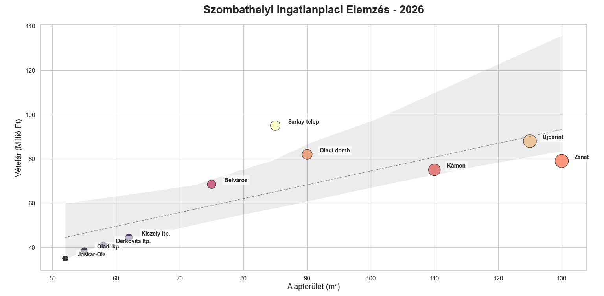

📊 Python Data Parsing & Visualization Script (Real Estate Market)
👨‍💻 Developer Profile
Balázs Kovács – IT Support & System Administration Student (Ensign College)

📝 Overview
A Python-based automation and data analysis tool designed to ingest, clean, and visualize large, unstructured datasets.

While this specific script processes real estate market trends from Szombathely, the core objective of this project is to demonstrate foundational System Administration and IT Support skills: the ability to take raw, messy data (similar to complex server logs or user databases), clean it using automated scripts, manage local databases, and extract actionable, clear insights.

🛠️ Technologies Used
Language: Python 3.10+

Database Management: SQLite3

Data Processing: Pandas

Data Visualization: Matplotlib, Seaborn

Web Scraping Simulation: Requests, BeautifulSoup

💡 Key IT & Troubleshooting Skills Demonstrated
Automated Database Lifecycle: The script automatically creates, validates, and populates SQL tables upon execution, demonstrating a strong understanding of relational data modeling.

Robust Error Handling: Implemented try-except blocks to capture specific issues (e.g., sqlite3.DatabaseError) to ensure system stability and provide clear diagnostic messages.

Automated Data Cleaning & Parsing: Utilized the pandas library to systematically query databases and organize information efficiently.

Visual Reporting: Translated raw database rows into clear, user-friendly visual charts (including regression analysis) to identify market anomalies and trends.

Version Control: Maintained clear project documentation and code history using Git and GitHub.

🎯 Why This Matters for IT Support
In a modern IT environment, identifying the root cause of an issue often requires parsing through thousands of lines of system logs, event viewers, or user data. This project showcases my analytical thinking and my ability to write Python scripts that automate data extraction, interact with local databases, and present findings clearly to both technical and non-technical stakeholders.

🚀 How to Run the Script
Clone this repository to your local machine:

Bash
git clone https://github.com/Bali8383/szombathely-ingatlan-vizu.git
Ensure you have Python installed, along with the required libraries:

Bash
pip install pandas matplotlib seaborn requests beautifulsoup4
Run the analysis script to generate the local database and visual reports:

Bash

python vizualizacio.py
